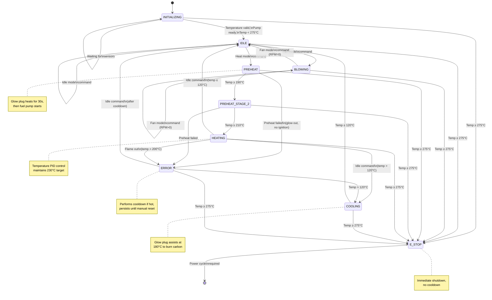

# Helios State Machine Documentation

## Overview

The Helios state machine manages the lifecycle of a liquid fuel burner designed for diesel-like fuels including used vegetable oil and used motor oil. The state machine ensures safe operation, proper ignition sequencing, temperature-based motor control, and safe shutdown with carbon deposit prevention.

**Normal Operating Temperature:** 220-230°C
**Safety Limit:** 275°C (emergency stop trigger)
**Maximum Safe Temperature:** 300°C (hardware damage threshold)

## State Diagram



## States

### INITIALIZING

**Purpose:** System startup and sensor validation.

**Entry Function:** None
**Exit Function:** None
**Run Function:** `initialize_helios()`

**Behavior:**
- Waits for valid temperature reading (non-zero)
- Waits for fuel pump to be ready
- Checks for fault temperature (≥275°C)
- Publishes initialization status via Zbus

**Transitions:**
- → **IDLE**: When temperature valid, pump ready, and temp < 275°C
- → **E_STOP**: If temperature ≥ 275°C (fault condition)

**Active Systems:** None

---

### IDLE

**Purpose:** System at rest, ready to accept commands.

**Entry Function:** `idle_entry()`
**Exit Function:** None
**Run Function:** `idle()`

**Entry Actions:**
- Stop fuel pump
- Stop motor (fan)
- Extinguish glow plug

**Behavior:**
- System idle, awaiting user commands
- All subsystems inactive

**Transitions:**
- → **BLOWING**: On fan mode command with RPM > 0
- → **PREHEAT**: On heat mode command
- → **IDLE**: On explicit idle mode command (from ERROR recovery)
- → **E_STOP**: If temperature ≥ 275°C

**Active Systems:** None

---

### BLOWING

**Purpose:** Fan-only mode for air circulation or cooling without combustion.

**Entry Function:** None
**Exit Function:** `stop_blowing_helios()`
**Run Function:** `blowing()`

**Exit Actions:**
- Stop motor (set RPM to 0)

**Behavior:**
- Motor runs at user-specified RPM
- No combustion (pump off, glow plug off)
- Used for air recirculation or pre-cooling

**Transitions:**
- → **IDLE**: On fan mode command with RPM = 0
- → **BLOWING**: On fan mode command with different RPM
- → **E_STOP**: If temperature ≥ 275°C

**Active Systems:**
- Motor (fan) at commanded RPM

---

### PREHEAT (Stage 1)

**Purpose:** Initial ignition preparation and fuel ignition.

**Entry Function:** `start_preheat()`
**Exit Function:** `end_preheat()`
**Run Function:** `preheat_helios()`

**Entry Actions:**
- Record preheat start time
- Set motor to 2500 RPM

**Exit Actions:**
- Clear preheat start time
- Clear glow plug lit timestamp

**Behavior:**
1. Wait for motor RPM to stabilize (within 5% margin)
2. Light glow plug (burns for 5 minutes max as timer)
3. Wait 30 seconds for glow plug and metal mesh to heat
4. Start fuel pump at 500ms interval
5. Monitor for ignition (temperature rise)

**Preheat Failure Conditions:**
- Glow plug extinguishes before reaching 190°C
- Indicates likely empty fuel tank or fuel line priming failure

**Transitions:**
- → **PREHEAT_STAGE_2**: When temperature ≥ 190°C
- → **ERROR**: If preheat fails (glow out, no temperature rise)
- → **E_STOP**: If temperature ≥ 275°C

**Active Systems:**
- Motor: 2500 RPM
- Glow plug: Lit
- Fuel pump: 500ms interval (after 30s delay)

**Configuration:**
- `PREHEAT_RPM`: 2500
- `PREHEAT_PUMP_DELAY`: 30 seconds
- `PREHEAT_PUMP_RATE`: 500ms
- `PREHEAT_GLOW_DURATION`: 5 minutes
- `PREHEAT_STAGE_2_TEMP`: 190°C

---

### PREHEAT_STAGE_2

**Purpose:** Stabilize combustion and reach full operating temperature.

**Entry Function:** None
**Exit Function:** None
**Run Function:** `preheat_stage_2()`

**Behavior:**
1. Increase motor RPM to 2800 for more airflow
2. Reduce pump rate to 250ms for leaner mixture
3. Monitor temperature rise
4. Track that high temperature has been reached (for cooldown requirement)

**Success Condition:**
- Temperature reaches ≥ 210°C while glow plug is still lit

**Transitions:**
- → **HEATING**: When temp ≥ 210°C and glow plug still lit
- → **ERROR**: If preheat fails (glow out before reaching temperature)
- → **E_STOP**: If temperature ≥ 275°C

**Active Systems:**
- Motor: 2800 RPM
- Glow plug: Lit (from stage 1)
- Fuel pump: 250ms interval

**Configuration:**
- `PREHEAT_STAGE_2_RPM`: 2800
- `PREHEAT_STAGE_2_PUMP_RATE`: 250ms
- `PREHEAT_SUCCESS_TEMP`: 210°C

---

### HEATING

**Purpose:** Normal operation with temperature-based motor control.

**Entry Function:** `heating_entry()`
**Exit Function:** `heating_exit()`
**Run Function:** `heating_helios()`

**Entry Actions:**
- Enable temperature PID control:
  1. Associate temperature controller with motor 0
  2. Set target temperature to 230°C
  3. Enable inverted PID control (higher temp → higher RPM)

**Exit Actions:**
- Disable temperature PID control
- Stop temperature controller from monitoring motor

**Behavior:**
1. Extinguish glow plug (combustion self-sustaining)
2. Set fuel pump to user-specified rate
3. Temperature controller automatically adjusts motor RPM via inverted PID:
   - Temperature too high → Increase motor RPM (more cooling)
   - Temperature too low → Decrease motor RPM (less cooling)
4. Track that high temperature has been reached (for cooldown requirement)

**Flame-out Detection:** *(Not yet implemented)*
- If temperature drops below 200°C, indicates fuel flow issue
- Should transition to ERROR state

**Transitions:**
- → **COOLING**: On idle command when temp > 120°C
- → **IDLE**: On idle command when temp ≤ 120°C (unlikely in practice)
- → **ERROR**: On flame-out (temp < 200°C) *(not yet implemented)*
- → **E_STOP**: If temperature ≥ 275°C

**Active Systems:**
- Motor: PID-controlled RPM (temp-based, typically 800-3400 RPM)
- Fuel pump: User-specified rate
- Temperature PID: Active

**Configuration:**
- `HEATING_TARGET_TEMP`: 230°C
- `FLAME_OUT_TEMP`: 190°C *(for future implementation)*

---

### COOLING

**Purpose:** Safe shutdown with glow plug assistance to prevent carbon buildup.

**Entry Function:** `cooldown_entry()`
**Exit Function:** `cooldown_exit()`
**Run Function:** `cooldown_helios()`

**Entry Actions:**
- Stop fuel pump (no new fuel)
- Disable temperature PID control

**Exit Actions:**
- Ensure glow plug is extinguished
- Stop motor (fan)
- Stop fuel pump

**Behavior:**
1. **Above 180°C:**
   - Motor runs at 2500 RPM for heat dissipation
   - Glow plug OFF

2. **At 180°C - 120°C:**
   - Motor runs at 2500 RPM
   - Glow plug ON to burn off residual fuel and carbon deposits
   - Prevents carbon buildup in combustion chamber

3. **Below 120°C:**
   - Cooldown complete
   - Transition to IDLE
   - Reset high temperature flag

**Why Cooldown is Critical:**
- Prevents carbon buildup in combustion chamber
- Glow plug burns off residual fuel at lower temperatures
- Ensures clean combustion chamber for next cycle
- Only skipped during emergency stop

**Transitions:**
- → **IDLE**: When temperature ≤ 120°C
- → **E_STOP**: If temperature ≥ 275°C

**Active Systems:**
- Motor: 2500 RPM (throughout cooldown)
- Glow plug: Active at 180-120°C range
- Fuel pump: OFF

**Configuration:**
- `COOLDOWN_GLOW_START_TEMP`: 180°C
- `COOLDOWN_COMPLETE_TEMP`: 120°C
- `COOLDOWN_FAN_RPM`: 2500

---

### ERROR

**Purpose:** Critical error handling with safe shutdown and user notification.

**Entry Function:** None *(should perform cooldown if needed)*
**Exit Function:** None
**Run Function:** None

**Behavior:**
- Performs cooldown if temperature > 120°C
- After cooldown, turns off fan
- State persists to notify user of required manual action
- Can be cleared by issuing idle command

**Common Error Causes:**

**During Preheat:**
- Empty fuel tank (most likely)
- Failed to prime fuel lines in 5 minutes (unlikely)
- Pump error state:
  - Solenoid not plugged in
  - Wiring fault
  - Failed continuity check

**During Heating:** *(not yet implemented)*
- Flame-out: Temperature dropped below 200°C
- Indicates fuel flow issue:
  - Empty fuel tank
  - Gelled fuel in lines (low ambient temperature)

**Recovery:**
- User must take corrective action (e.g., refill fuel tank)
- Clear error by issuing idle mode command
- System performs cooldown if needed, then transitions to IDLE

**Transitions:**
- → **COOLING**: If temperature > 120°C (automatic cooldown)
- → **IDLE**: On idle command (after cooldown or if already cool)
- → **E_STOP**: If temperature ≥ 275°C

**Active Systems:**
- During cooldown: Motor and glow plug as per COOLING state
- After cooldown: None (waiting for user intervention)

---

### E_STOP (Emergency Stop)

**Purpose:** Immediate safety shutdown for critical fault conditions.

**Entry Function:** None *(not yet implemented)*
**Exit Function:** None *(not yet implemented)*
**Run Function:** None *(not yet implemented)*

**Trigger Conditions:**
- Temperature ≥ 275°C (FAULT_TEMP)
- Emergency mode command *(not yet implemented)*

**Behavior:**
- **Immediately** shut off all systems:
  - Motor (fan) → 0 RPM
  - Fuel pump → OFF
  - Glow plug → OFF
- **No cooldown performed** (safety override)
- Terminal state requiring power cycle to clear

**Why No Cooldown:**
- Safety takes precedence over carbon buildup prevention
- 275°C indicates potential hardware damage risk
- PTFE wires and seals can be damaged above 300°C
- Immediate shutdown prevents further temperature rise

**Recovery:**
- Requires complete power cycle of the system
- User must investigate cause before restart

**Transitions:**
- → **[System Reset]**: Power cycle required

**Active Systems:** None (everything immediately shut off)

**Safety Margin:**
- Operating temp: 220-230°C
- Emergency trigger: 275°C
- Hardware damage: 300°C
- Safety margin: 25°C

---

## State Transitions Summary

### User Commands

| Command | Current State | Next State | Condition |
|---------|--------------|------------|-----------|
| Idle Mode | Any (except E_STOP) | IDLE or COOLING | COOLING if temp > 120°C after heating |
| Fan Mode (RPM > 0) | IDLE | BLOWING | - |
| Fan Mode (RPM = 0) | BLOWING | IDLE | - |
| Heat Mode | IDLE | PREHEAT | - |

### Automatic Transitions

| Trigger | Current State | Next State | Condition |
|---------|--------------|------------|-----------|
| Temp ≥ 190°C | PREHEAT | PREHEAT_STAGE_2 | - |
| Temp ≥ 210°C | PREHEAT_STAGE_2 | HEATING | Glow plug still lit |
| Temp ≤ 120°C | COOLING | IDLE | Cooldown complete |
| Preheat Failed | PREHEAT or PREHEAT_STAGE_2 | ERROR | Glow plug out, no ignition |
| Flame Out | HEATING | ERROR | Temp < 200°C *(not implemented)* |
| Temp ≥ 275°C | Any | E_STOP | Fault temperature reached |

## Entry and Exit Functions

| State | Entry Function | Exit Function | Purpose |
|-------|---------------|---------------|---------|
| IDLE | `idle_entry()` | - | Stop all systems |
| BLOWING | - | `stop_blowing_helios()` | Stop motor |
| PREHEAT | `start_preheat()` | `end_preheat()` | Start motor, clear timestamps |
| PREHEAT_STAGE_2 | - | - | - |
| HEATING | `heating_entry()` | `heating_exit()` | Enable/disable temperature PID |
| COOLING | `cooldown_entry()` | `cooldown_exit()` | Stop pump/PID, ensure clean shutdown |
| ERROR | - | - | - |
| E_STOP | - | - | *(not implemented)* |

## Configuration Constants

### Temperature Thresholds

```c
#define FAULT_TEMP 275.0              // Emergency stop trigger
#define PREHEAT_STAGE_2_TEMP 190.0    // Stage 1 → Stage 2 transition
#define PREHEAT_SUCCESS_TEMP 210.0    // Stage 2 → Heating transition
#define BURN_TEMP 220.0               // Normal operating temperature
#define HEATING_TARGET_TEMP 230.0     // PID control target
#define FLAME_OUT_TEMP 190.0          // Flame-out detection (not implemented)
#define COOLDOWN_GLOW_START_TEMP 180.0 // Start glow plug during cooldown
#define COOLDOWN_COMPLETE_TEMP 120.0   // Cooldown complete threshold
```

### Motor (Fan) RPM

```c
#define PREHEAT_RPM 2500           // Stage 1 preheat
#define PREHEAT_STAGE_2_RPM 2800   // Stage 2 preheat
#define COOLDOWN_FAN_RPM 2500      // During cooldown
// HEATING: PID-controlled (800-3400 RPM range)
```

### Fuel Pump Rates

```c
#define PREHEAT_PUMP_RATE 500         // Stage 1: 500ms interval
#define PREHEAT_STAGE_2_PUMP_RATE 250 // Stage 2: 250ms interval
// HEATING: User-specified rate
```

### Timing

```c
#define PREHEAT_PUMP_DELAY 30 * 1e6      // 30s wait before fuel pump
#define PREHEAT_GLOW_DURATION 5 * 60 * 1000 // 5min glow plug timeout
```

## Safety Features

### Temperature Monitoring
- Continuous temperature monitoring via thermometer
- Emergency stop at 275°C (25°C safety margin before hardware damage)
- Flame-out detection at <200°C during heating *(to be implemented)*

### Cooldown Protection
- Automatic cooldown when shutting down from operating temperature
- Prevents carbon buildup in combustion chamber
- Glow plug assists at lower temperatures (180-120°C)
- Only skipped during emergency stop

### Preheat Safety
- 5-minute timeout via glow plug duration
- Automatic error state if ignition fails
- Prevents indefinite fuel pumping

### Error Handling
- Safe cooldown even in error conditions
- User notification via persistent error state
- Clear recovery path (refuel → idle command)

### Hardware Protection
- PTFE wires and seals rated to 300°C
- 275°C emergency stop provides safety margin
- Immediate shutdown in fault conditions

## Temperature PID Control

During HEATING state, an inverted PID controller maintains target temperature:

**PID Configuration:**
- Target Temperature: 230°C
- Controlled Variable: Motor (fan) RPM
- RPM Range: 800-3400 (dynamically learned from motor)
- Control Type: Inverted (higher temp → higher RPM)

**Operation:**
1. Temperature controller monitors thermometer reading
2. Compares to 230°C target
3. Calculates required motor RPM using inverted PID
4. Higher temperature → Increases fan speed (more cooling)
5. Lower temperature → Decreases fan speed (less cooling)

**Why Inverted:**
- Increasing fan speed increases airflow
- More airflow increases cooling
- Therefore: higher RPM = lower temperature

## Implementation Status

### Implemented
- ✅ INITIALIZING state
- ✅ IDLE state
- ✅ BLOWING state
- ✅ PREHEAT state (stage 1)
- ✅ PREHEAT_STAGE_2 state
- ✅ HEATING state with temperature PID
- ✅ COOLING state with carbon prevention
- ✅ ERROR state (partial - cooldown needs implementation)
- ✅ Automatic cooldown on shutdown

### Not Yet Implemented
- ❌ E_STOP state (declared but no implementation)
- ❌ Flame-out detection during HEATING
- ❌ Automatic cooldown in ERROR state
- ❌ Emergency mode command handling
- ❌ Automatic E_STOP trigger on FAULT_TEMP

## Fuel Types

The burner is designed for diesel-like fuels with similar combustion temperatures:
- Diesel fuel
- Kerosene
- Used vegetable oil
- Used motor oil

**Operating Temperature Range:** 220-230°C
**Safety Limit:** 275°C (emergency stop)
**Hardware Limit:** 300°C (PTFE and seal damage threshold)
